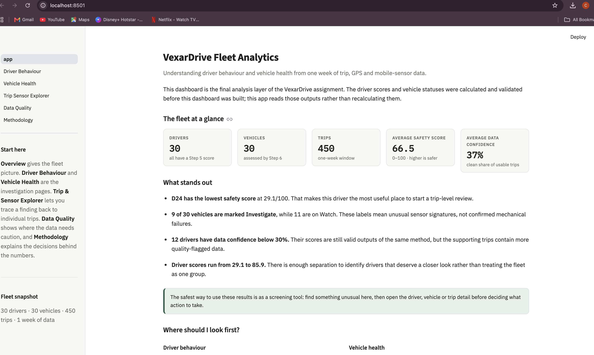

# VexarDrive Fleet Analytics — Streamlit Dashboard

A Streamlit dashboard built on top of the validated Step 5 (Driver Safety Score) and Step 6
(Vehicle Health) analytical outputs. The dashboard does not recalculate anything —
every score, status, threshold, and weight is read as-is from
`data/driver_safety_scores.csv` and `data/vehicle_health.csv`.

## How to run

```bash
cd vexardrive_dashboard
pip install -r requirements.txt
streamlit run app.py
```

Then open the URL Streamlit prints (usually `http://localhost:8501`).

## Pages
## 📸 Dashboard Preview



| # | Page | File |
|---|------|------|
| 1 | Executive Overview | `app.py` |
| 2 | Driver Behaviour | `pages/1_Driver_Behaviour.py` |
| 3 | Vehicle Health | `pages/2_Vehicle_Health.py` |
| 4 | Trip & Sensor Explorer | `pages/3_Trip_Sensor_Explorer.py` |
| 5 | Data Quality | `pages/4_Data_Quality.py` |
| 6 | Methodology & Assumptions | `pages/5_Methodology.py` |

## Data used (all read-only, copied unchanged from `processed/analytical/`)

**Source of truth (Step 5 / Step 6):**
- `driver_safety_scores.csv`, `safety_score_summary.json`, `safety_score_validation_checks.csv`
- `vehicle_health.csv`, `vehicle_health_summary.json`, `vehicle_health_validation_checks.csv`

**Supporting analytical layer (Step 3 / Step 4), used for the Trip & Sensor Explorer
and Data Quality pages only — never used to derive a score or status:**
- `drivers.csv`, `vehicles.csv`, `trips.csv`, `telemetry.csv`
- `driver_trip_features.csv`, `feature_validation_checks.csv`, `feature_summary.json`
- `cleaning_summary.json`, `trip_overlaps_driver.csv`, `trip_overlaps_vehicle.csv`

No file under `data/` is modified by this app. `data/driver_safety_scores.csv` and
`data/vehicle_health.csv` are byte-identical to the Step 5/6 outputs they were copied
from (verified with md5sum before packaging).

## What was verified before shipping

- Every source `.py` file compiles cleanly (`python -m py_compile`).
- Every page was executed headlessly with Streamlit's `AppTest` runner — zero
  exceptions on initial load.
- The Driver Behaviour and Vehicle Health selectors were exercised across several
  drivers/vehicles (including the lowest-scoring driver, a low-confidence driver,
  and an "Investigate" vehicle) with zero exceptions.
- Spot-checked driver scores and vehicle statuses in the app against
  `driver_safety_scores.csv` / `vehicle_health.csv` directly — match exactly, as
  expected, since the app only reads these files.

## Known non-issues

Streamlit prints a deprecation notice for `use_container_width` in the console —
cosmetic only, does not affect functionality on the pinned Streamlit version.

## Project story

This project asks a practical fleet question: which driving patterns deserve a closer look, and which vehicles show unusual sensor behaviour? The dashboard is designed to make those findings easy to investigate rather than hide them behind a single headline number.

The most important design choice is transparency. Driver scores are shown alongside data confidence, vehicle statuses are described as investigation signals rather than mechanical diagnoses, and the Trip & Sensor Explorer lets a reviewer trace a result back to the underlying trip data.
